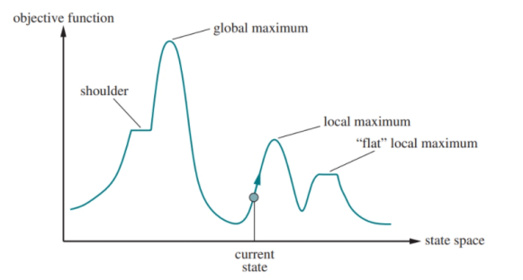

# AY2510-cs3243-midterm
## Week 1
AI are intelligent mechanisms that solve problems to help humans, expected to be at least as fast as humans.
Intelligence assessed based on the mechanism’s `generality` and `performance`.
### Strong AI
General problem solvers &rarr; solve many different problems
### Weak / Narrow AI
Less dynamic &rarr; solve fewer problems, most AI's are like this, `easier` to formalise.
### Agent Framework
1. `Sensors` &rarr; Perceive and capture environment
2. `Agent function`
3. `Actuators` &rarr; How the agent affects the environment
### Environment Properties
1. `Fully` vs `partially` observable
2. `Deterministic` vs `stochastic`
3. `Episodic` vs `sequential`
   1. `Episodic` → actions only impact the current state (not those beyond)
   2. `Sequential` → an action may impact all future decisions
4. `Discrete` vs `Continuous`
5. `Single` vs `multi`-agent
6. `Known` vs `unknown`
7. `Static` vs `dynamic`
### Types of Agents
1. `Reflex` agents &rarr; rules for limited cases (`if-else` statements)
2. `Model-based reflex` agents
3. `Goal-based` and `utility-based` agents &rarr; (un)informed search, local search
   1. Also called `problem-solving` agents
4. `Learning` agents

## Week 2 - Problem-Solving Agents & Path Planning
### PSA/Goal-based agents
- Uses graph search algorithm
- Able to find solutions to **ANY** problem case as it assumes `generalisable` problem
### Assumed environment
`Fully observable`, `Deterministic`, `Discrete`, `Episodic`
- Plan is `sequential`, problem is `episodic`
### Defining search space
1. `State representation`:  Abstract data type (`ADT`) containing data describing an `instance` of the environment.
2. `Actions`: Function that returns the possible actions, A = {a<sub>1</sub>, ..., a<sub>k</sub>} at a given state s<sub>i</sub>.
3. `Transition model`:  Function that returns the `intermediate state` transitioned to,
s<sub>i</sub><sup>'</sup>, when action a<sub>j</sub> is applied at state s<sub>i</sub>
4. `Goal test`: Function that returns 1 if given state s<sub>i</sub> is a goal state, else returns 0
5. `Action costs`: Function that returns cost, v, of taking the action a<sub>j</sub> at state s<sub>i</sub> to reach the intermediate state s<sub>i</sub><sup>'</sup>
   1. Generally, assume costs ≥ 0 (unless otherwise stated)
6. `Initial state`: s<sub>0</sub> [may not have the same format as other states]
### General Search Algorithm (Tree Search): never keep track of reached/visited nodes, no paths excluded
```python
Function TreeSearch(initial_state, actions, T, isGoal, cost):
    frontier = {Node(initial_state, NULL)} # ADT: Node(current_state, parent_node)
    while frontier not empty: # add path cost, depth, action as required
        current = frontier.pop()
        if isGoal(current.state): return current.getPath() # late goal test
        for a in actions(current.state):
            successor = Node(T(current.state, a), current)
            frontier.push(successor)
    return failure # i.e., no path from the initial state to any goal state
```
Each element of the frontier is a Node that must include
- Referenced end point of path, state `s`
- Parent node, for Linked List reference(with `Action` taken, defines the path, i.e., plan)
- Other attributes
  - Action–also facilitates backtracking in `DFS` – i.e., `O(m)` space complexity
  - Path cost –for efficient `UCS` (avoids traversing path Linked List)
  - Depth–for efficient `DLS`/`IDS` (avoids traversing path Linked List)
### `States` vs `Nodes`
State &rarr; A representation of the environment at some timestamp\
Node &rarr; Element in frontier containing `state`, `parent node`, `action`, `path cost`, `depth`
### Uninformed &rarr; no domain knowledge beyond search problem formulation
| Algorithm                        | Frontier                        |
|:---------------------------------|:--------------------------------|
| BFS                              | queue                           |
| UCS                              | priority queue                  |
| DFS                              | stack                           |
| DLS (Depth-Limited Search)       | variation of DFS with max depth |
| IDS (Iterative Deepening Search) | iterative version of DLS        |

Algorithm criteria: 1. Efficiency &rarr; time, space complexity, 2. Correctness &rarr; `complete`, `optimal`
### BFS, tie-breaking: alphabetic order on push to frontier
Frontier Trace &rarr; Iteration `n`: {B(A), C(A, D)}\
Assume that BFS does `early goal test`, can save one more branch factor.
### UCS, tie-breaking: alphabet
Frontier Trace &rarr; Iteration `n`: {A((-), 0)}\
Determining path cost is `O(1)` since we store the current path cost in each node\
e = 1+⌊C*/ε⌋ comes from `late goal test` + expected steps to reach goal (each step extends paths by at least ε)\
`Late goal test` ensures optimality!!!
### DFS, tie-breaking: reverse alphabetic order on push to frontier
DFS space complexity can be improved to `O(m)` with backtracking.
- i.e., tracing back to parent and last action taken (assuming fixed order of actions
  recall that we store parent node and action taken at parent)
### Summary (m denotes maximum depth)
|   Criterion   |       BFS        |           UCS           |       DFS        |       DLS        |       IDS        |
|:-------------:|:----------------:|:-----------------------:|:----------------:|:----------------:|:----------------:|
|   Complete?   | Yes<sup>1</sup>  |    Yes<sup>1,2</sup>    | No<sup>3</sup3>  |        No        | Yes<sup>1</sup>  |
| Optimal Cost? |  No<sup>4</sup>  |           Yes           |        No        |        No        |  No<sup>4</sup>  |
|     Time      | O(b<sup>d</sup>) | O(b<sup>1+⌊C*/ε⌋</sup>) | O(b<sup>m</sup>) | O(b<sup>ℓ</sup>) | O(b<sup>d</sup>) |
|     Space     | O(b<sup>d</sup>) | O(b<sup>1+⌊C*/ε⌋</sup>) |      O(bm)       |      O(bℓ)       |      O(bd)       |
1. Complete if `b` finite and either has a solution or `m` finite
2. Complete if all actions costs are > ε > 0
3. DFS is `incomplete` unless the search space is finite – i.e., when `b` finite and `m` finite
4. Cost optimal if action costs are all identical (and several other cases)

Default assumptions: `b` finite, `d` finite (contains solution), `m` infinite, all costs > ε > 0
### Graph Search Algorithm (Version 1) adds a state to reached upon enqueueing
```python
Function GraphSearchV1(initial_state, actions, T, isGoal, cost):
    initial_node = Node(initial_state, NULL)
    frontier = {initial_node}
    reached = {initial_state: initial_node}
    while frontier not empty:
        current = frontier.pop()
        if isGoal(current.state): return current.getPath()
        for a in actions(current.state):
            successor = Node(T(current.state, a), current)
            if successor.state not in reached:
                frontier.push(successor)
                reached.insert(successor.state: successor)
    return failure
```
Nodes are `never revisited`, may omit `optimal path`.\
Since `BFS` / `DFS` / `DLS` / `IDS` all cannot guarantee optimality, 
using `Graph Search Version 1` decreases complexity 
(since the resultant search tree excludes ALL
redundant paths) without loss of expected performance!

### Graph Search Algorithm (Version 2) adds a state to reached upon enqueueing but re-enqueues it lower path cost is found
```python
Function GraphSearchV1(initial_state, actions, T, isGoal, cost):
    initial_node = Node(initial_state, NULL)
    frontier = {initial_node}
    reached = {initial_state: initial_node}
    while frontier not empty:
        current = frontier.pop()
        if isGoal(current.state): return current.getPath()
        for a in actions(current.state):
            successor = Node(T(current.state, a), current)
            if successor.state not in reached or
                successor.getCost() < reached[successor.state].getCost():
                    frontier.push(successor)
                    reached.insert(successor.state: successor)
    return failure
```
More relaxed constraint on paths that are considered, also considers paths with lower path cost.
### Summary (Graph Search Implementations)
Time, space for everyone (BFS, UCS, DFS, DLS, IDS) is `O(|V|+|E|)`, bounded by the size of the search space.
Note that `we do not need to check for cheaper paths` under graph search for `BFS` and `DFS` since
costs play no part in those algorithms, and they cannot guarantee an optimal solution anyway.
### Notes
For CS3243, unless otherwise mentioned, `assume tree search`.\
For graph search, assume `V2` for UCS and `V1` for other uninformed search algorithm.
## Week 3 - Informed Search: Incorporating Domain Knowledge
Systematic search affords `completeness`, assuming either: search space finite, or solution exists.\
Informed search is about searching less, search towards the goal!\
Evaluation functions: Greedy Best-First Search priority: `f(n) = h(n)`\
A* Search priority: `f(n) = g(n) + h(n)`
### Best-First Search Algorithm
```python
function BEST-FIRST-SEARCH(problem, f) returns a solution node or failure
    node <- NODE(STATE=problem.INITIAL)
    frontier <- a priority queue ordered by f, with node as an element
    reached <- a lookup table, with one entry with key problem.INITIAL and value node
    while not IS-EMPTY(frontier) do
        node <- POP(frontier)
        if problem.IS-GOAL(node.STATE) then return node
        for each child in EXPAND(problem, node) do
            s <- child.STATE
            if s is not in reached or child.PATH-COST < reached[s].PATH-COST then
                reached[s] <- child
                add child to frontier
    return failure

function EXPAND(problem, node) yields nodes
    s <- node.STATE
    for each action in problem.ACTIONS(s) do
        s` <- problem.RESULT(s, action)
        cost <- node.PATH-COST + problem.ACTION-COST(s, action, s`)
        yield NODE(STATE=s`, PARENT=node, ACTION=action, PATH-COST=cost)
```
`Tree-search` implementation is `incomplete`!
- Can get stuck in a loop between nodes where `h` values are lowest

`Graph-search` implementation is `complete` if search space is `finite`.\
`Not optimal` under either tree search or graph search.
## A* search
- `Completeness` requires same criteria as `UCS`.
- `Optimality` depends on `h`.
  - A traversal of paths in ascending order based on path cost is required to ensure optimality
- `GSV1` may skip optimal path.
- `GSV2` and `Tree search with admissibility` returns optimal path.
## Graph Search Algorithm (Version 3) adds a state to reached after popping it
```python
Function GraphSearchV3(initial_state, actions, T, isGoal, cost):
    frontier = {Node(initial_state, NULL)}
    reached = {}
    while frontier not empty:
        current = frontier.pop()
        reached.insert(current.state: current)
        if isGoal(current.state): return current.getPath()
        for a in actions(current.state):
            successor = Node(T(current.state, a), current)
            if successor.state not in reached:
                frontier.push(successor)
    return failure
```
*Note: with typical interpretations, dominance requires admissibility.*
## Week 4 - Heuristics
Theorem: If `h(n)` is admissible, then A* using `tree search` is `optimal`.
- Main idea: by the time we explore a path to a goal, P, all paths with actual costs less than P must be explored

Theorem: If `h(n)` is consistent, then A* using `graph search V2/V3` is `optimal`.
### Remember:
1. `admissible`: never overestimates
2. `consistent`: never overestimates, monotonically increasing
   1. g(n) + h(n) ≤ g(n) + cost(n, a, n') + h(n')
### Summary
1. UCS
   1. `Optimal` under `Tree Search`, `GSV2`, `GSV3`
2. Greedy Best-First Search
   1. `Not optimal`
   2. `Incomplete` under tree search
3. A* Search
    1. Assuming admissible `h`: `Optimal` under `Tree Search`, `GSV2`
    2. Assuming consistent `h`: `Optimal` under `Tree Search`, `GSV2`, `GSV3`

*Note: Assume graph search version 2 and late goal testing for UCS and A\* (unless otherwise stated)*
### Building h
Ideally, `h` is `O(1)` or something reasonably cheap.
We build `h` by relaxing the problem!\
Main point: relax a little bit of constraints (more liberties means worse approximation)
### Rules to Functions
Finding functions that model or approximate the quantity you want (efficiently)\
Constructing models:
1. Bottom-up: What variables can you efficiently calculate? What can these variables model?
2. Top-down: What (dependent) variables do I want to model / approximate? What are the (independent) variables that help to calculate these?
## Week 5 - Local Search: Goal Versus Path Search
We only want legal goal state values.\
Local search – goal determination
- Abandon systematic search – ignore path and path cost
- Only maintain “best” successor state – greedy approach

Advantage: Only store current and immediate successor states\
Space complexity: `O(b)`, may be reduced to `O(1)` if successors may be processed one at a time
### Local Search via Hill-Climbing
```python
Function HillClimbing(initial_state, eval_fn, highest_valued_successor):
    current = initial_state
    while True:
        neighbour = highest_valued_successor(current) # find neighbour with best h
        if eval_fn(neighbour) <= eval_fn(current): return current # no improvement
        current = neighbour # traverse to this neighbour
```
How it works:
1. Initial state is typically random
2. Frontier only stores current (best) state
3. For each iteration, find a `successor` that **improves** on the current state
4. If none exists, `return` `current` as the best state

We do not need nodes, only concerned with `state` information.\
Hill-climbing **may not** return a solution, it may get stuck at
- Local Maxima
- Shoulder or Plateau
- Ridge (sequence of local maxima)


### Hill-climbing variants:
#### A. Stochastic hill climbing
- Chooses randomly among states with `f`-values better than `current`
#### B. First-choice hill climbing
- Handles high `b` by randomly generating successors until one with better f-value than current is
  found (instead of generating all possible successors)
- May even work with infinite `b`
#### C. Sideways move
- Replaces ≤ with <
- Allows continuation when eval_fn(neighbour) == eval_fn(current)
- Can traverse shoulders / plateaus
#### D. Random-restart hill climbing
- Different algorithm 
- Adds an outer loop which randomly picks a new starting state
- Keeps attempting random restarts until a solution is found
```python
Function RandomRestarts(isGoal, random_initial_state, eval_fn, highest_valued_successor):
    current = NULL
    while current is NULL or not isGoal(current):
        current = random_initial_state()
        current = HillClimbing(current, eval_fn, highest_valued_successor)
    return current
```
*Note: Requires function to generate random initial state* `random_initial_state()`
### Local Beam Search
Beam (window) (each iteration) stores `k` best successors (actually `k` starts), initial beam: {A, B, C}
- Better than `k` parallel random restarts
```python
Function BeamSearch(random_initial_state, isGoal, actions, T, choose_best_k):
    frontier = {}
    for i in 1 to k:
        s = random_initial_state()
        if isGoal(s): return s
            frontier.push(s)
    while True: # As the search may loop infinitely, it may be wise to define and use an iteration threshold
        new_frontier = {}
        while frontier not empty:
            s = frontier.pop()
            for a in actions(s):
                new_s = T(s, a)
                if isGoal(new_s): return new_s
                new_frontier.push(new_s)
        frontier = choose_best_k(new_frontier) 
# We may also apply stochastic beam search where instead of choosing the best k, it chooses successors with probability proportional to the successor’s value
```
Notice that we may allow states with lower values than their parents to be added since
`choose_best_k` will simply choose the best `k` successor states generated.
## Tips
1. Proving: `contradiction`, `induction`
2. When proving admissibility or consistency, maintain good use of mathematical symbols, e.g. &forall;!
3. Use keywords like `minimally`
4. When giving a transition model, mention that given a `parent state` and `action`...
5. Node representation: store `parent node`!!!
6. The need to traverse the whole graph (let's say I need to fine `h*` for each point) precludes `graph search`, `G` needs to be acyclic and finite though.
7. States can be represented via a `frontier`.
8. `Node`: what can I store as I go along?
9. Pre-processing helps if doing it once before search helps than doing the step at every time point during traversal.
10. Question 2: `Give a proof sketch`
11. `Heuristic` question is very long, 1.5 pages in description, nothing about dominance in it, only `admissibility`.
12. for `k` beam search, enqueue `k` best, then pop `k` best.
13. Determine consistency: check all possible pairs of subsequent neighbours
