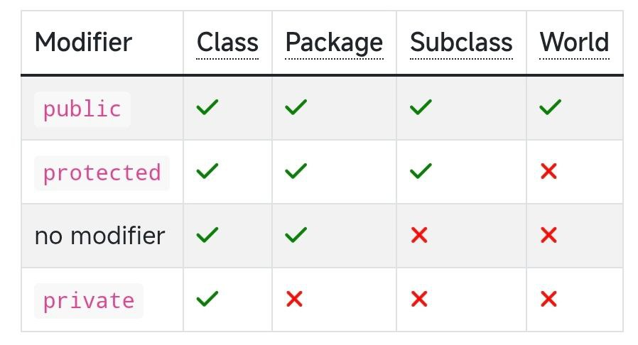
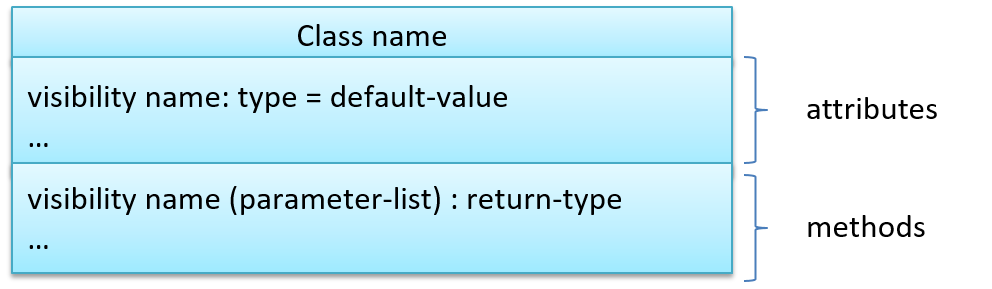
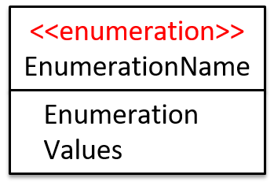
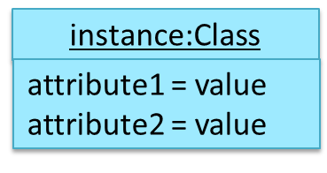
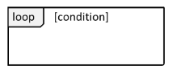
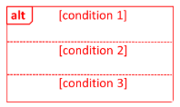
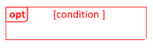
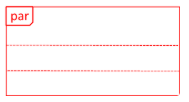
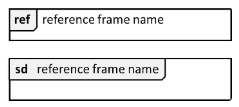

## Week 1
OO has higher level mechanism than the procedural paradigm.  
Every object has an `interface` and `implementation`:
- `interface` -> other objects interact with it
- `implemetation` -> supports the interface  

Encapsulation -> `packaging` and `information hiding`  

Constructors are not inherited by subclasses. If a constructor doesn't explicitly invoke a superclass constructor, the Java
compiler automatically inserts a call to the no-argument constructor of the superclass. If the superclass xda
no-argument constructor, you will get a `compile-time error`.  

No access modifier -> `public`

Having an abstract method makes you an abstract class!  

Interfaces can also contain `constants` and `static` methods.  

Dynamic binding -> `Overriden` methods, Static binding -> `Overloaded` methods

Polymorphism: `substitutability`, `operation overriding`, `dynamic binding`  

Exceptions: `Checked exceptions`, `Errors`, `Runtime exceptions`

## Week 2
### SDLC1: Sequential Model (Waterfall model)
Not good because have to state all requirements accurately.
### SDLC2: Iterative Model
1. Breadth-first -> an iteration evolves everything in parallel
2. Depth-first -> fleshing out only some components/functionality area  

Regression Testing -> re-testing of the software to detect regressions after modification  
Semiautomatic testing of CLI app -> input/output redirection (feed, compare with actual output)

## Week 3
Integration -> Combining parts of a software product  
Gradle, Maven -> `build automation`, `dependency` management tools  
Continuous Integration (CI) -> integration, building, and testing happens `automatically` after each code change  
Continuous Deployment (CD): changes not only integrated, but deployed to end-users at the same time  

Importing a package **does not** import its sub-packages. `Static` import -> import `static` members of a type.  

The earlier a bug is found, the `easier` and `cheaper` to have it fixed. Else consequences: hard to locate,
major rework, bugs hidden by other bugs, need to delay delivery.   

A test driver is the code that `drives` the SUT for the purpose of testing.
`JUnit` is a tool for automated testing of Java programs. Unit testing -> testing individual units (in isolation)  

Stubs isolate the SUT from its dependencies, i.e. same interface, but simple implementation (unlikely to have bugs)

## Week 4
### Class diagrams (describe structure, not behaviour of OOP solution)

`Operations` and/or `attributes` can be omitted  
Visibility (**no default**): `+` for public, `-` for private, `#` for protected, `~` for package private  

Generic classes: a dotted-sided rectangle at top right corner with texts such as `Element`, `? extends E`  
Class-level members: `underline`, e.g. <u>totalStudents</u>  
Association: either `solid line` or as an attribute like `name: type[multiplicity] = default value`
- Association labels -> describe meaning of association (small solid triangle), e.g. `uses |>`
- Association roles -> indicate the role, it is placed closer to the class that it belongs to
- Multiplicity -> placed closer to the class that it belongs to, `0..1` is optional, `*` is 0 or more
  - it has `no default`
- Navigability -> uni/bidirectional, (two uni is not bi), use arrowheads (in object diagrams too)  

(I) Notes : additional information, (II) Inheritance: triangle and solid line  
(III) Composition: `whole-part` relationship, solid diamond symbol  
(IV) Aggregation: `container-contained` relationship, hollow diamond  
(V) Dependency: transient interaction, dashed arrow  
(VI) Abstract: *ClassName* or {abstract} and ClassName (2 lines)  
(VII) Method abstract: *method1()* or method1() {abstract} (1 line)  
(VIII) Interface: triangle and dashed line, `<<interface>>` followed by class name (2 lines)   
(IX) Association classes: dashed line connected to an association link

### Object diagram (shows an object structure at a given point of time)

**No compartment** for methods. Attributes *can* be omitted. Object name can be omitted. No multiplicities.
Association: `solid line`  
Static analysis: analyse code without executing it (like CheckStyle, PMD, FindBugs)

## Week 5
Greenfield: from scratch, Brownfield: replace/update  
FR: what the `system should do`, NFR: `constraints` under which the system is developed & operated  
- NFR: Data, environment requirements, accessibility, security, domain rules, technical requirements, performance
requirement, quality requirements, process requirements, notes about project scope...

Gathering requirements: `Brainstorming`, `Product surveys`, `Observation`, `User surveys`, `Interviews`,
`Focus groups`, `Prototyping`  

Specifying: `Prose`, `Feature Lists`, `User Stories`, `Glossary`, `Supplementary Requirements`

User stories: `As a user, I can ... so that I can {benefit}`, high level -> `epic`, can capture NFRs too,
convenient for `scoping`, `estimation`, and `scheduling`.

Readability: `Avoid long methods`, `Avoid deep nesting`, `Avoid complicated expressions`, `Avoid magic numbers`,
`Make the code obvious`, `Do not trip up reader`, `Keep it simple, stupid (KISS)`, `Avoid premature optimizations`, `SLAP`,
`Make happy path prominent`  

Prevent Error-Prone: `use default branch`, `no recycle variable/parameter`, `avoid empty catch blocks`, `delete dead code`,
`minimize scope of variables (less global)`, `minimize code duplication`  

Comments: `do not repeat obvious`, `write to reader`, `explain what, why not how`  

Refactoring: restructuring code in small steps w/o modifying external behaviour  

Assertions: define assumptions about the program state, use it liberally

## Week 6
Sequence diagrams -> model interactions between multiple entities.  
(I) Entities: actors/components, (II) Activation Bar (optional): Period when method is being executed  
(III) Lifeline: instance is alive (dashed vertical line), `X` means die [ready to be garbage-collected]  
(IV) Invoke operation: `solid filled` arrow head, (V) Return (optional): dashed filled arrow head  
(VI) Classes: `:ClassName` (if name unspecified) or `objectname:ClassName`  
(VII) Alt: no more than one alternative partitions be executed (can be none)  
(VIII) Method calls to static methods: add a `<<class>>` on top of the class name  
(IX)) Ref frame: show as separate sequence diagram, `sd` gives full picture

Architecture diagrams -> display architecture, is free-form  
Debugging -> discovering defects, using debugger `>>` putting print/manually tracing  
Logging -> record info during prog exe for future ref (log file is black box of an airplane)  

## Week 7
Use case -> A description of a set of sequences of actions, including variants, that a system
performs to yield an observable result of value to an actor
- Only describe externally visible behaviour, not stuff `LMS saves the file into the cache`
- Gives intention, not mechanics (omit UI details)
- Extensions numbering style is not a universal rule, only widely used (3a means happen after 3)
can also use `<<extend>>` with dotted arrow (point from extension to current use case)
- Can include another use case, dotted arrow and an `<<include>>` notation
- Preconditions: state the system is expected to be in before use case starts
- Guarantee: specify promises

Software Design (product/external and implementation/internal): Top-down, Bottom-up, Mix   
Agile Design: expect design to change over product's lifetime, opposite of *full upfront design*  
Design Fundamentals: `Abstraction`, `Coupling`, `Cohesion`  
1. Abstraction: `data abstraction`, `control abstraction` details of actual control flow
2. Coupling: measure of dependence
3. Cohesion: measure of how strongly-related and focused the various responsibilities of a component are

Integration approaches: `Late and one time` vs `Early and frequent`, `Big-bang` vs `incremental`  
Project planning: `milestones`, `buffers`, `issue trackers`, `work breakdown structure (WBS)`, `Gantt charts`  
Team structures: `egoless`, `chief programmer`, `strict-hierarchy`  
RCS: `Centralized (CRCS)`, `Distributed RCS (DRCS)`  
Workflow: `Forking`, `Feature branch`, `Centralized`

## Week 8
Testing: `Integration testing`, `System testing` (include NFRs), `Acceptance testing (user requirements)`,
`Alpha (by user under controlled cond.)/Beta testing (selected subset of target user naturally)`, `Dogfooding`  
Approaches: `Scripted`, `Exploratory/Reactive/Erorr guessing/Attack-based/Bug hunting`   
Dependency injection: injecting objects to replace current dependencies with a different object  

Test coverage: metric used to measure the extent to which testing exercises the code, criteria:
1. Function/method coverage: based on functions executed
2. Statement coverage: based on LoC executed
3. Decision/branch coverage: based on decision points exercised
4. Condition coverage: based on boolean sub-expressions
5. Path coverage: based on possible paths through a given part of the code executed

Test-Driven Development (TDD): advocates writing the tests before writing the SUT, while evolving functionality and
tests in small increments

## Week 9
Conceptual Class Diagrams (OODMs): captures `class structures` in the problem `domain`.  
Domain modelling via: `domain-specific notation`, `general purpose modelling notation`, `other`

### Activity Diagram (AD, model workflows)
(I) start: solid point, (II) end: solid point with a circle surrounding it  
(III) action: rounded-corners rectangle, (IV) flow: solid arrow heads  
(V) branch node: rhombus, with `[condition 1]`,`[condition 2]`:
multiple arrows can start from the same corner of a branch node, `[Else]` can be omitted  
(VI) merge node (optional): rhombus, (VII) fork node, join node: a bar  
(VIII) rake: give as a separate diagram, (IX) swimlane diagrams: partition an AD to show who is doing what

### Architecture Diagram
Minimize the variety of symbols, Avoid the discriminate use of double-headed arrows

### Design Principles
1. Separation of concerns principle (SoC): To achieve better modularity, separate the code into distinct sections,
such that each section addresses a separate concern (feature/aspect/entity).
   1. Higher cohesion, lower coupling
   2. Utilised by `n-tier architecture`
2. Single responsibility principle (SRP): A class should have one, and only one, reason to change.
3. Liskov substitution principle (LSP): Derived classes must be substitutable for their base classes. Subclass should not be more restrictive!
4. Open-closed principle (OCP): A module should be open for extension but closed for modification.
That is, modules should be written so that they can be extended, without requiring them to be modified.
5. Law of Demeter (LoD):
   1. An object should have limited knowledge of another object.
   2. An object should only interact with objects that are closely related to it.

SOLID: SRP + OCP + LSP + Interface Segregation Principle (ISP) + Dependency Inversion Principle (DIP)

Agile processes (focus on individuals&interactions/working software/customer collab/responding to change):
1. eXtreme Programming (XP): stresses customer satisfaction, emphasises teamwork, simple rules
   1. communication, simplicity, feedback, respect, and courage
2. Scrum (customers can change minds during project)
   1. Scrum Master, Product Owner (stakeholders & business), Team
   2. Iterations -> Sprints
   3. Sprint (basic unit of development) -> preceded by planning meeting, daily scrum...

### Developer Docs
Developer-to-developer documentation: documentation for `developer-as-user` or `developer-as-maintainer`

Good:
`tutorials`, `how-to guides`, `explanation` and `technical reference`.  

Aim for comprehensibility:
1. Use plenty of diagrams
2. Use plenty of examples
3. Use simple & direct explanations
4. Get rid of statements tht do not add value
5. It is not a good idea to have separate sections for each type of artifact

When writing project documents, a top-down breadth-first explanation is easier to understand than a bottom-up one.
Aim for 'just enough' developer documentation.
Focus on providing higher level information that is not readily visible in the code or comments.  

## Week 10
Design pattern: An elegant reusable solution to a commonly recurring problem within a given context in software design.  
How: `Context`, `Problem`, `Solution`, `(O) Anti-patterns`, `(O) Consequences`, `(O) Other info`

Design patterns: `Singleton` pattern (only one instance), `Facade` pattern, `Command` pattern

Defensive programming: Enforcing compulsory associations, dont need to be all the time

Testing: Effective (find a lot of bugs) and efficient (find more bugs in less steps)

Test case design (exhaustive is not practical):
1. Positive vs Negative test case
2. Black box vs Glass box
   1. Black-box: specification-based or responsibility-based (specified external behaviour)
   2. White/Glass-box: structured or implementation-based
   3. Gray-box approach: uses some important information about the implementation.
3. Based on use cases

Equivalence partitions: avoid testing too many, ensure all partitions tested

Data participants for EPs:
- the target object of the method call 
- input parameters of the method call 
- other data/objects accessed by the method such as global variables.
This category may not be applicable if using the black box approach
(because the test case designer using the black box approach will not
know how the method is implemented).

Boundary Value Analysis: for bugs in the EPs: `below`, `in`, `above`

## Week 11
Design Patterns: MVC (Model, View and Controller), Observer

Architectural Styles (most apps use a mix):
1. n-tier style (multi-layered, layered): higher layers make use of services provided by lower layers
2. client-server style (distributed applications): at least one component playing the role of a server and
at least one client component accessing the services of the server
3. event-driven style (GUIs): controls the flow of the application by detecting events
from event emitters and communicating those events to interested event consumers
4. transaction processing style: dispatcher controls execution of each transaction (queue/order/undo)
5. service-oriented style (SOA): combine funct packaged as PAS

Test input comb strats:
`all combinations`, `at least once`, `all pairs` (for a pair of inputs, all combos tested)
, `random`. Heuristics: `each valid input at least once in a positive test case`,
`test invalid inputs individually before combining them`,

QA: Validation (are you building the right system, are the requirements correct?),
Verification (are you building the system right, are the requirements implemented correctly)  
Formal verification -> Uses math techniques to prove the correctness of a program  
Reuse, APIs (Application Programming Interface), Libraries, Frameworks, 