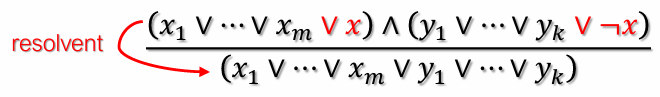

Taxonomy of Problems → Problem Environment Properties
* Fully Observable or Partially Observable 
* Deterministic or Stochastic
* Episodic or Sequential (assume sequential)
* Discrete or Continuous (assume discretised)
* Single Agent or Multi-Agent (assume single)
  * except for one competing agent under Adversarial Search
* Known or Unknown (assume known)
* Static or Dynamic (assume static)

### Complete information (fully observable, deterministic)
1. Graph: find goal path/state
   * Uninformed: BFS, DFS, DLS, IDS, UCS
   * Informed: Best-first greedy search, A* search
   * Local: hill-climbing
2. Constraint problem: find goal state
   * CSP: backtracking CSP
3. Multi-agent (one competing agent)
   * Adversarial search: Minimax, alpha-beta pruning

### Incomplete information (partially observable, deterministic)
Model problem environment as a knowledge base, then use
inference engine to solve by finding goal path or path with optimal utility
* Logical Agent is non-planning (interact with problem environment)
* Inference algorithms: Truth Table Enumeration, Resolution

### Stochastic problem (uncertainty handled via BN) (fully/partially observable)
Bayesian Networks
- Decision-Theoretic Agent makes decision by optimising expected utility
- Bayesian algorithms: Naive Bayes, Bayesian Network

Analysis of representation
* Correctness
* Complexity or tree size in terms of `b`, `m`

### Defining search space
1. `State representation`:  Abstract data type (`ADT`) containing data describing an `instance` of the environment.
2. `Actions`: Function that returns the possible actions, A = {a<sub>1</sub>, ..., a<sub>k</sub>} at a given state s<sub>i</sub>.
3. `Transition model`:  Function that returns the `intermediate state` transitioned to,
   s<sub>i</sub><sup>'</sup>, when action a<sub>j</sub> is applied at state s<sub>i</sub>
4. `Goal test`: Function that returns 1 if given state s<sub>i</sub> is a goal state, else returns 0
5. `Action costs`: Function that returns cost, v, of taking the action a<sub>j</sub> at state s<sub>i</sub> to reach the intermediate state s<sub>i</sub><sup>'</sup>
    1. Generally, assume costs ≥ 0 (unless otherwise stated)
6. `Initial state`: s<sub>0</sub> [may not have the same format as other states]

### General Search Algorithm (Tree Search): never track visited nodes, no paths excluded
```python
Function TreeSearch(initial_state, actions, T, isGoal, cost):
    frontier = {Node(initial_state, NULL)} # ADT: Node(current_state, parent_node)
    while frontier not empty: # add path cost, depth, action as required
        current = frontier.pop()
        if isGoal(current.state): return current.getPath() # late goal test
        for a in actions(current.state):
            successor = Node(T(current.state, a), current)
            frontier.push(successor)
    return failure # i.e., no path from the initial state to any goal state
```
Each element of the frontier is a Node that must include
- Referenced end point of path, state `s`
- Parent node, for Linked List reference (with `Action` taken, defines the path, i.e., plan)
- Other attributes
    - Action – also facilitates backtracking in `DFS` – i.e., `O(m)` space complexity
    - Path cost – for efficient `UCS` (avoids traversing path Linked List)
    - Depth – for efficient `DLS`/`IDS` (avoids traversing path Linked List)

### `States` vs `Nodes`
State &rarr; A representation of the environment at some timestamp  
Node &rarr; Element in frontier containing `state`, `parent node`, `action`, `path cost`, `depth`  

Algorithm criteria: 1. Efficiency &rarr; `time`, `space` complexity, 2. Correctness &rarr; `complete`, `optimal`  

### BFS, tie-breaking: alphabetic order on push to frontier
Frontier Trace &rarr; Iteration `n`: {B(A), C(A, D)}  
Assume that BFS does `early goal test`, can save one more branch factor.  
Given `b`, solution depth `d`, and tree search implementation, BFS will expand $((b^{d+1}-1)/3)-1$  
BFS may never find a goal state even if it exists if the popping is randomised.

### UCS, tie-breaking: alphabet
Frontier Trace &rarr; Iteration `n`: {A((-), 0)}  
Determining path cost is `O(1)` since we store the current path cost in each node  
e = 1+⌊C*/ε⌋ comes from `late goal test` + expected steps to reach goal (each step extends paths by at least ε)  
`Late goal test` ensures optimality!!!

### DFS, tie-breaking: reverse alphabetic order on push to frontier
DFS space complexity can be improved to `O(m)` with backtracking.
- i.e., tracing back to parent and last action taken (assuming fixed order of actions
  recall that we store parent node and action taken at parent)

## Path search recap

|   Criterion   |       BFS        |           UCS           |       DFS        |       DLS        |       IDS        |
|:-------------:|:----------------:|:-----------------------:|:----------------:|:----------------:|:----------------:|
|   Complete?   | Yes<sup>1</sup>  |    Yes<sup>1,2</sup>    | No<sup>3</sup3>  | Yes<sup>5</sup>  | Yes<sup>1</sup>  |
| Optimal Cost? |  No<sup>4</sup>  |           Yes           |        No        |        No        |  No<sup>4</sup>  |
|     Time      | O(b<sup>d</sup>) | O(b<sup>1+⌊C*/ε⌋</sup>) | O(b<sup>m</sup>) | O(b<sup>ℓ</sup>) | O(b<sup>d</sup>) |
|     Space     | O(b<sup>d</sup>) | O(b<sup>1+⌊C*/ε⌋</sup>) |      O(bm)       |      O(bℓ)       |      O(bd)       |
1. Complete if `b` finite and either has a solution or `m` finite
2. Complete if all actions costs are > ε > 0 [lower bounded by a positive value]
3. DFS is `incomplete` unless the search space is finite – i.e., when `b` finite and `m` finite
4. Cost optimal if action costs are all identical (and several other cases)
5. Complete ONLY if `d` <= depth limit

Default assumptions: `b` finite, `d` finite (contains solution), `m` infinite, all costs > ε > 0

### Graph Search Algorithm (Version 1) adds a state to reached upon enqueueing
```python
Function GraphSearchV1(initial_state, actions, T, isGoal, cost):
    initial_node = Node(initial_state, NULL)
    frontier = {initial_node}
    reached = {initial_state: initial_node}
    while frontier not empty:
        current = frontier.pop()
        if isGoal(current.state): return current.getPath()
        for a in actions(current.state):
            successor = Node(T(current.state, a), current)
            if successor.state not in reached:
                frontier.push(successor)
                reached.insert(successor.state: successor)
    return failure
```
Nodes are `never revisited`, may omit `optimal path`.\
Since `BFS` / `DFS` / `DLS` / `IDS` all cannot guarantee optimality,
using `Graph Search Version 1` decreases complexity
(since the resultant search tree excludes ALL
redundant paths) without loss of expected performance!

### Graph Search Algorithm (Version 2) adds a state to reached upon enqueueing but re-enqueues it lower path cost is found
```python
Function GraphSearchV2(initial_state, actions, T, isGoal, cost):
    initial_node = Node(initial_state, NULL)
    frontier = {initial_node}
    reached = {initial_state: initial_node}
    while frontier not empty:
        current = frontier.pop()
        if isGoal(current.state): return current.getPath()
        for a in actions(current.state):
            successor = Node(T(current.state, a), current)
            if successor.state not in reached or
                successor.getCost() < reached[successor.state].getCost():
                    frontier.push(successor)
                    reached.insert(successor.state: successor)
    return failure
```
### Best-First Search
Late Goal Test, GSV2, $f(n)=h(n)$  
Tree Search &rarr; incomplete; Graph Search &rarr; complete if finite search space; $\neg$Optimal in either  
Assume GSV1 (unless otherwise stated)

### A* Search  
Complete if criteria = UCS  
Theorem: If $h(n)$ is `admissible`, A* tree search/GSV2 is `optimal`  
Theorem: If $h(n)$ is `consistent`, A* GSV2/GSV3 is `optimal`    
Consistent heuristic (`f` monotonically increases): $h(n) <= cost(n,a,n') + h(n')$  
Assume GSV2, late goal test, same as UCS (unless otherwise stated)

### Graph Search Algorithm (Version 3) adds a state to reached after popping it
```python
Function GraphSearchV3(initial_state, actions, T, isGoal, cost):
    frontier = {Node(initial_state, NULL)}
    reached = {}
    while frontier not empty:
        current = frontier.pop()
        reached.insert(current.state: current)
        if isGoal(current.state): return current.getPath()
        for a in actions(current.state):
            successor = Node(T(current.state, a), current)
            if successor.state not in reached:
                frontier.push(successor)
    return failure
```

### Hill-climbing
Variants: `Stochastic` (random better neighbour), `First-choice`, `Sideways move`, `Random-restart`

### Local Beam Search
Beam (window) (each iteration) stores `k` best successors (actually `k` starts), initial beam: {A, B, C}
- Better than `k` parallel random restarts

## Constraint Satisfaction Problem (CSP)
- Generalised goal-search solution 
- Formulation → `Variables` + `Domains` + `(U/B) Constraints` (with constraint graph representation)
- Uses backtracking search (DFS)

Variable order (fail-first): `MRV heuristic`, tie-break via `degree` (most constraints)  
Value order (fail-last): `LCV heuristic` (sum of domain size of var that share a constraint with $x'$)  
Inference: `Forward Checking`, `AC-3` (time complexity $O(n^2d^3)$)

By enforcing arc consistency before each value assignment, we guarantee that we will
not backtrack when the `unassigned` variables form a `tree/acyclic structure`.  

Forward checking &rarr; propagates information from `assigned` to `unassigned` variables

## Adversarial search – assumes 2-player, zero-sum game
- Formulation additionally requires: `Player` + `Terminal` + `Utility`
- Assume an opponent strategy to plan
- Minimax algorithm (based on backtracking) – assumes optimal opponent (given utility)

Minimax algorithm
- Complete (assuming finite game tree)
- Optimal (assuming opponent plays optimally)
- Time $O(b^m)$, space $O(bm)$ or just $O(m)$

$\alpha-\beta$ pruning
- Given a `MIN` node `n`, stop searching below `n` if
  - There exists some `MAX` **ancestor** `m` (of `n`) where $\alpha(m) >= \beta(n)$
- Given a `MAX` node `m`, stop searching below `m`, if
  - There exists some `MIN` **ancestor** `n` (of `m`) where $\beta(n) <= \alpha(m)$
- Initially: $\alpha(n)=-\infty, \beta(n)=+\infty$
- Time complexity:
  - $O(b^{m/2})$ for perfect ordering
  - $O(b^{3m/4})$ for random ordering if $b<1000$
- Linearly scaled utilities will not change order of pruning
- Random shuffling child nodes with same utility will cause less pruning

```python
function minimax(position, depth, alpha, beta, maximizingPlayer)
    if depth == 0 or game over in position
        return static evaluation of position

    if maximizingPlayer
        maxEval = -infinity
        for each child of position
            eval = minimax(child, depth - 1, alpha, beta, false)
            maxEval = max(maxEval, eval)
            alpha = max(alpha, eval) # alpha only gets updated at MAX player
            if beta <= alpha # same constraint to prune (1)
                break
        return maxEval

    else
        minEval = +infinity
            for each child of position
            eval = minimax(child, depth - 1, alpha, beta, true)
            minEval = min(minEval, eval)
            beta = min(beta, eval) # beta only gets updated at MIN player
            if beta <= alpha # same constraint to prune (2)
                break
        return minEval
```

Best-score-first ordered trees can still have more nodes explored than non-best-score-first trees.

## Logical Agents (non-planning)
Inference Engine (IE) &rarr; Domain-independent algorithms; KB &rarr; Domain-specific content  
Modelling: $v$ models $\alpha$ if $\alpha$ is *true* under $v$
* $v$ corresponds to one set of value assignments / one instance of the environment
* $M(\alpha):=$ set of all models for $\alpha$

Entailment ($\models$): right follows from left
* $\alpha \models \beta$ is equivalent to $M(\alpha) \subseteq M(\beta)$ (what makes $\alpha$ true makes $\beta$ true too)

KB $\vdash_A \alpha$ means sentence $\alpha$ is `derived` / `inferred` 
from KB by inference algorithm $A$
* Soundness: $A$ is sound if KB $\vdash_A \alpha$ implies KB $\models \alpha$
  * $A$ only infers $\alpha$ that are valid
* Completeness: $A$ is complete if KB $\models \alpha$ implies KB $\vdash_A \alpha$
  * $A$ is able to infer all valid $\alpha$

Rules (combine both to get exactly 1):
1. At most 1 rule: $\forall combi(i,j): \neg X_i\vee\neg X_j$
2. At least 1 rule: $\vee_{(i,j)\in Domain}: X_{(i,j)}$

Example of exactly 2 out of 3:
1. $A\vee B$ (at least 2)
2. $A\vee C$ (at least 2)
3. $B\vee C$ (at least 2)
4. $\neg A\vee\neg B\vee\neg C$ (at most 2)

### Inference Algorithm 1 - TTE
* $O(2^n)$ time complexity, $O(n)$ space complexity
* Implements definition of entailment directly (guarantees `soundness`)
* Finite models to check (guarantees `completeness`)
* Kinda like a special case of CSP

Inference rules examples:
1. And-Elimination (AE): e.g., $a\wedge b\models a;a\wedge b\models b$
2. Modus Pones (MP): e.g., $a\wedge (a\Rightarrow b)\models b$
3. Logical Equivalences

CNF (conjunctive normal form) = conjunction of disjunctive sentences

### Inference Algorithm 2 - Resolution: Simplifying KB to prove entailment of query $\alpha$
* Given KB: $R_1 \wedge R_2 \wedge ... \wedge R_n$
* If a literal, $x$, appears in $R_i$ and its negation, $\neg x$, appears
in $R_j$, where $R_i, R_j \in KB$, it can be removed from both!
* Resolution verifies $KB\wedge \neg \alpha$ is **unsatisfiable**
  * Start be copying KB including negation of query, $\neg \alpha$
* Utilises `proof by contradiction`
* When to end:
  * If `empty clause` then can infer $\alpha$
  * If `no more resolutions and not empty clause` then cannot infer $\alpha$



## Uncertainty
Given that $Pr[T_1\wedge...\wedge T_{n-1}\wedge S]=Pr[T_1|S]\times...\times Pr[T_{n-1}|S]\times Pr[S]$  
SIze of joint probability table: $2(n-1)+1$ [advantage of conditional independence]

### Conditionally probability tables (CPT) for representing Bayesian network:  
Distribution over $Z$ for each combination of `parent` values.

Naive Bayes theorem:  
$Pr[Cause|E_1,E_2,...,E_n]$
= $\frac{Pr[Cause]Pr[E_1,...,E_n|Cause]}{Pr[E_1,...,E_n]}$  
= $\frac{Pr[Cause]}{Pr[E_1,...,E_n]} \times \Pi_i Pr[E_i|Cause]$  
= $\alpha \times Pr[Cause] \times \Pi_i Pr[E_i|Cause]$
- When comparing, for example, the probability of $Cause$ and $\neg Cause$, $\alpha$
remains constant, so the calculations may be normalised  

Relationships
1. Independent Events: $Pr[A\wedge B \wedge C]=Pr[C]Pr[A]Pr[B]$
2. Independent Causes: $Pr[A\wedge B \wedge C]=Pr[C|A,B]Pr[A]Pr[B]$
3. Conditionally Independent Events: $Pr[A\wedge B \wedge C]=Pr[C|A]Pr[B|A]Pr[A]$

A variable's Markov blanket: `its parents`, `its children`, `its children's parents`

Decision-Theoretic Agent
* Decision Theory = Probability Theory + Utility Theory
* `Maximum Expected Utility` (MEU) Principle 
  * Pick action with highest utility weighted over probable outcomes

```python
function DT-AGENT(percept) returns an action
    persistent: belief state, probabilistic beliefs about the current state of the world
    action, the agent's action
    
    update belief state based on action and percept
    calculate outcome probabilities for actions,
        given action descriptions and current belief_state
    select action with highest expected utility
        given probabilities of outcomes and utility information
    return action
```
### Niche extras
$h(goal)=0,h(non-goal)=1$ will make A*, GSV3 behave same s BFS on problems with uniform and positive action costs. 
- behave the same means equal sequence of expansion + answer given 

Greedy best-first search with $h(n)=-g(n)$ is the same as DFS with uniform and positive action costs.  
GSV2, infinite depth search space, goal exists: IDS with backtracking, BFS is optimal (note space complexity though)  
`False` statement: A consistent heuristic will dominate an admissible but inconsistent heuristic  
`True` statement: A tree search implementation of UCS is complete on finite search trees where all action costs are >= 0.  
`True` statement: The above statement but now
all action costs are greater than some small positive constant ε.  
`False` statement: Under A* GSV2 where an admissible heuristic is utilised, a
node can never be repeatedly visited.  
`False` statement: Under A* GSV3 where a consistent heuristic is utilised, a
node may be repeatedly visited.  
`False` statement: DFS always expands at least as many nodes as A* search with an admissible heuristic.
- A* would have to explore all paths with a total `$f(n)=g(n)+h(n)` value that is less than $h^*(s)$

`False` statement: Given consistent $h_1$ and inconsistent but admissible $h_2$, A* $h_1$ expand no more than A* $h_2$